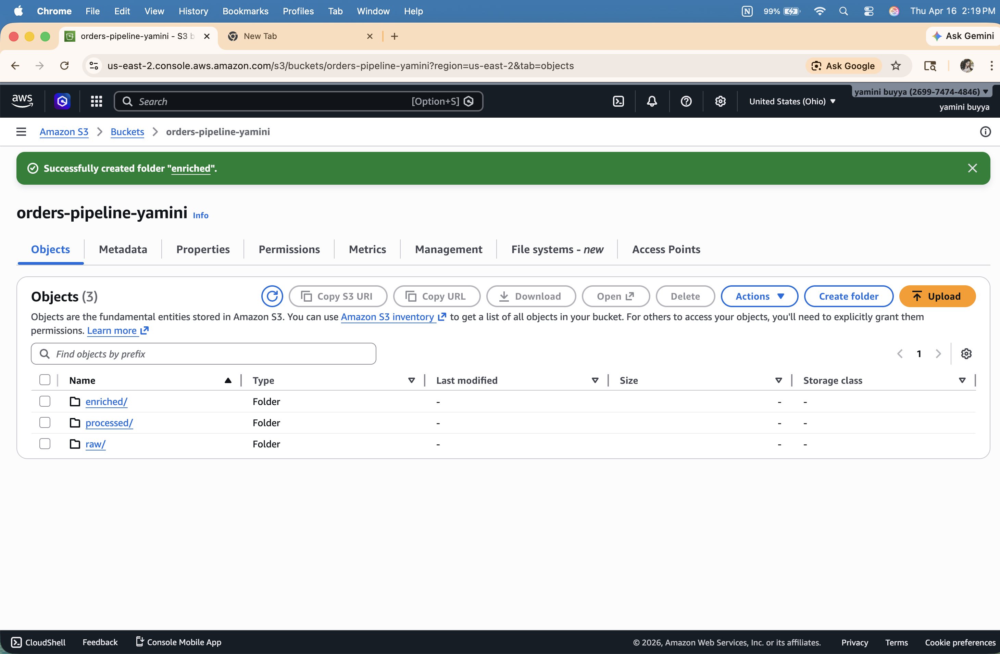
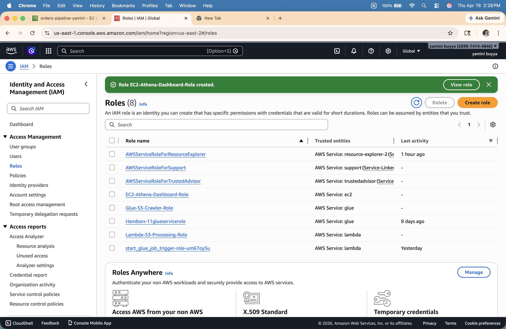
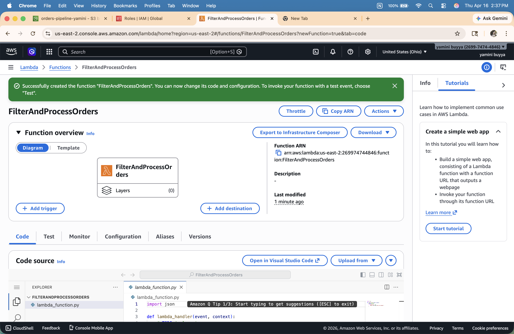
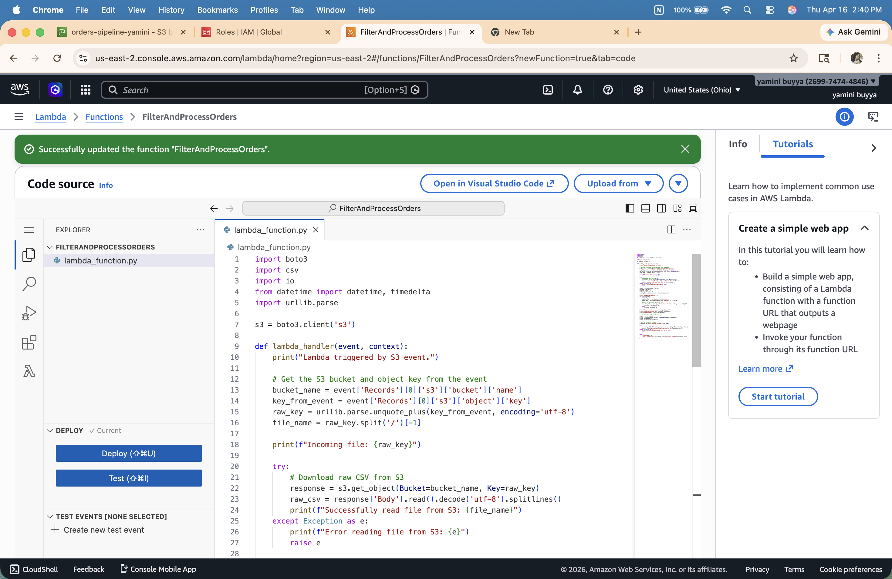
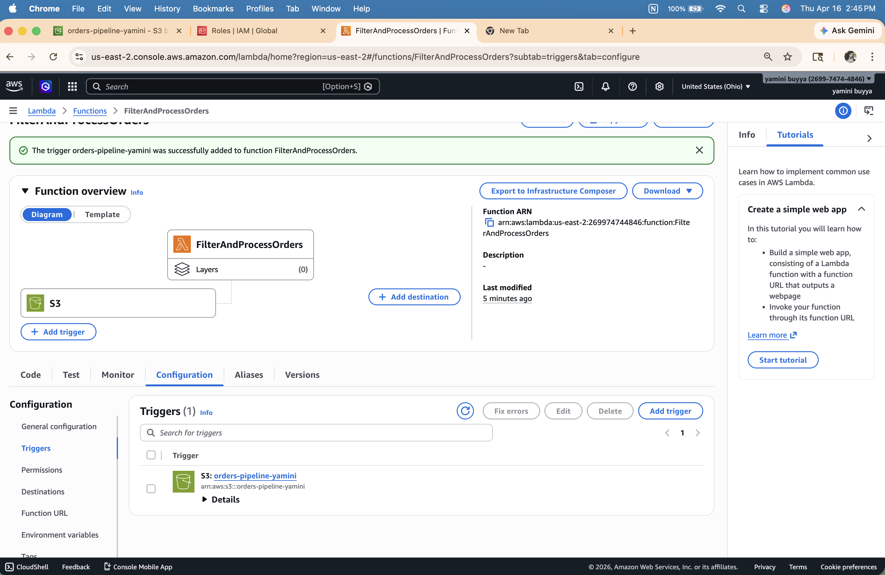
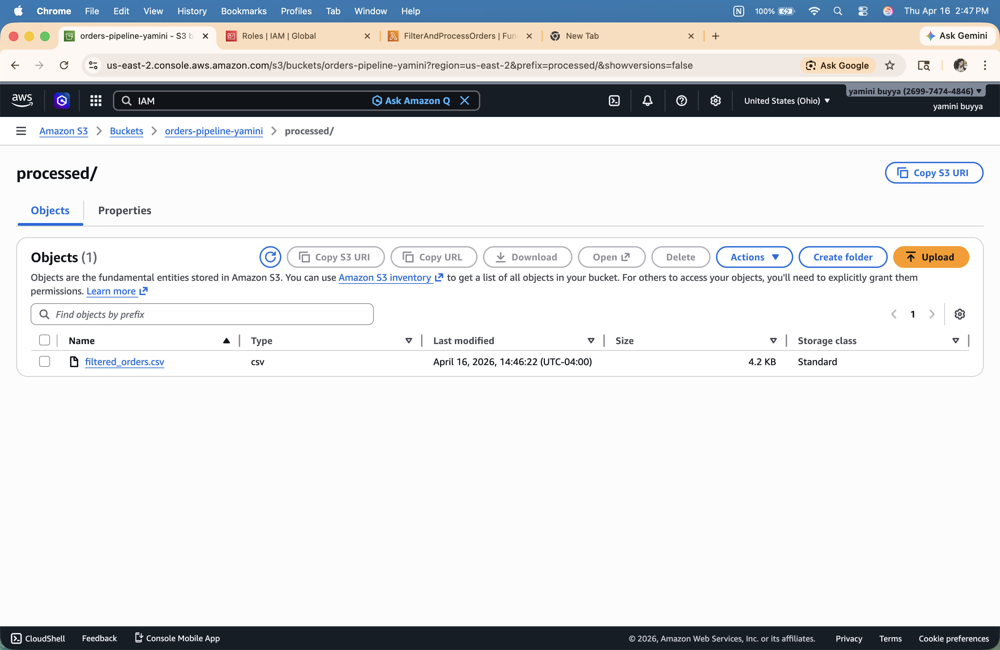
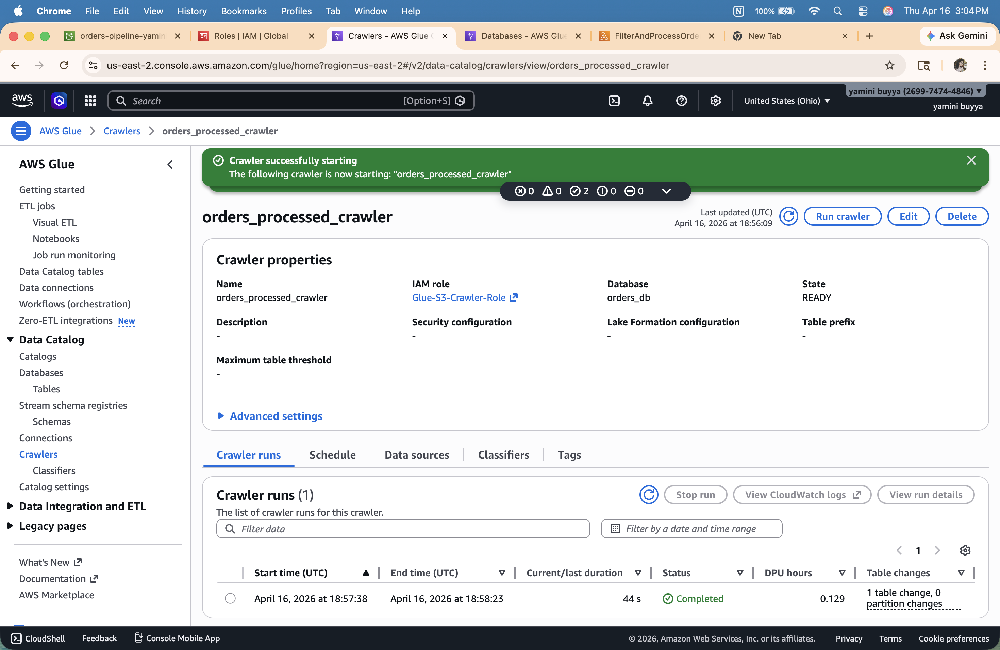
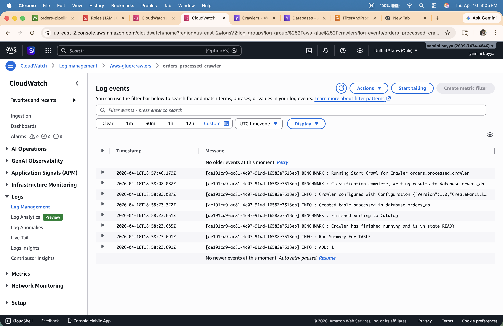
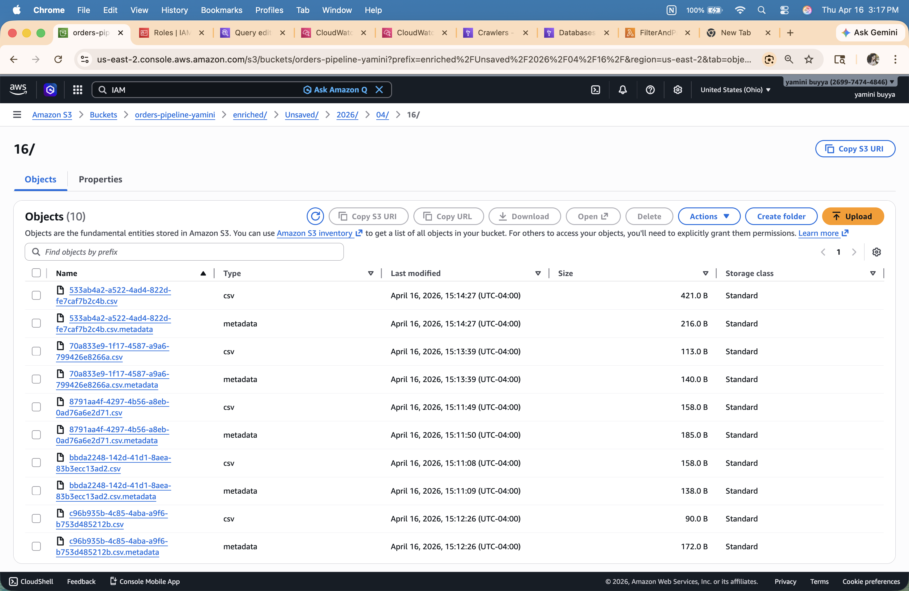
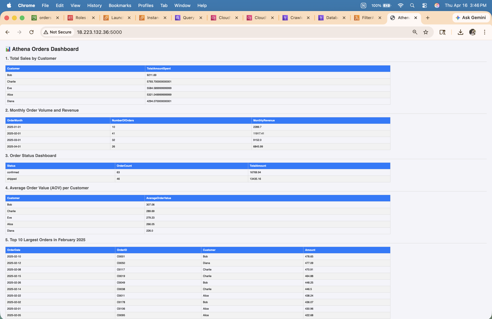

# ITCS-6190 Assignment 3: AWS Data Processing Pipeline

## Project Overview

This project demonstrates an end-to-end serverless data processing pipeline on AWS. The core idea is to automate the entire data workflow — from raw data ingestion to visual analytics — without any manual intervention.

## Approach

The pipeline follows these stages:

1. Raw CSV data is uploaded to an S3 landing zone
2. An S3 event automatically triggers a Lambda function
3. Lambda filters and cleans the data and saves it to a processed folder
4. A Glue Crawler scans the processed data and creates a queryable catalog
5. Athena runs SQL queries on the catalog and saves results to an enriched folder
6. A Flask web app hosted on EC2 reads the Athena results and displays them as a live dashboard

**Data Flow:**
S3 (raw/) → Lambda (filter) → S3 (processed/) → Glue Crawler → Athena (queries) → S3 (enriched/) → EC2 Flask Dashboard

---

## 1. Amazon S3 Bucket Structure 🪣

### Explanation

Amazon S3 (Simple Storage Service) is used as the data lake for this pipeline. Instead of using multiple buckets, a single bucket with three folders is used to represent different stages of the data lifecycle. This approach keeps the architecture simple and cost-effective.

### Approach

Created an S3 bucket named `orders-pipeline-yamini` with three folders representing the three stages of data processing:

- **`raw/`**: The landing zone where raw input CSV files are uploaded. This folder acts as the trigger point for the entire pipeline.
- **`processed/`**: After Lambda filters the raw data, the cleaned output is saved here. This folder is the source for the Glue Crawler.
- **`enriched/`**: Athena saves all SQL query results here. This folder is the source for the EC2 web dashboard.

---

## 2. IAM Roles and Permissions 🔐

### Explanation

AWS Identity and Access Management (IAM) is used to securely control which AWS services can access other services. Each service gets only the permissions it needs — this follows the principle of least privilege. Three separate roles were created, one for each service.

### Approach

Created the following IAM roles:

### Lambda Execution Role

- **Role name:** `Lambda-S3-Processing-Role`
- **Purpose:** Allows the Lambda function to read from and write to the S3 bucket, and to log to CloudWatch.
- **Policies attached:**
  - `AWSLambdaBasicExecutionRole` — allows Lambda to write logs to CloudWatch
  - `AmazonS3FullAccess` — allows Lambda to read raw files and write processed files to S3

### Glue Service Role

- **Role name:** `Glue-S3-Crawler-Role`
- **Purpose:** Allows the Glue Crawler to scan the processed S3 folder and create a data catalog table.
- **Policies attached:**
  - `AmazonS3FullAccess` — allows Glue to read the processed folder
  - `AWSGlueConsoleFullAccess` — allows full access to Glue console
  - `AWSGlueServiceRole` — core Glue service permissions

### EC2 Instance Profile

- **Role name:** `EC2-Athena-Dashboard-Role`
- **Purpose:** Allows the EC2 instance to run Athena queries and read results from S3 without needing hardcoded credentials.
- **Policies attached:**
  - `AmazonS3FullAccess` — allows EC2 to read Athena results from enriched folder
  - `AmazonAthenaFullAccess` — allows EC2 to execute Athena queries

---

## 3. Create the Lambda Function ⚙️

### Explanation

AWS Lambda is a serverless compute service that runs code in response to events. In this pipeline, Lambda acts as the data transformation layer. It is automatically triggered when a CSV file is uploaded to the `raw/` folder, processes the data, and saves the output to the `processed/` folder — all without any manual intervention.

### Approach

The Lambda function performs the following steps:

1. Reads the uploaded CSV file from the `raw/` S3 folder
2. Filters out orders with status `pending` or `cancelled` that are older than 30 days
3. Writes the filtered rows to a new CSV file in the `processed/` folder

**Configuration:**

- **Function name:** `FilterAndProcessOrders`
- **Runtime:** Python 3.10
- **Permissions:** Selected existing role `Lambda-S3-Processing-Role`
- Pasted the `LambdaFunction.py` code into the editor and clicked **Deploy**

---

## 4. Configure the S3 Trigger ⚡

### Explanation

The S3 trigger connects the S3 bucket to the Lambda function. When a new file is uploaded to the `raw/` folder, S3 automatically sends an event notification to Lambda. This makes the pipeline fully automated — no manual steps are needed to start the processing.

### Approach

Configured the S3 trigger with the following settings to ensure Lambda only fires for CSV files in the raw folder:

1. In the Lambda function overview, clicked **+ Add trigger**
2. **Source:** S3
3. **Bucket:** `orders-pipeline-yamini`
4. **Event types:** All object create events
5. **Prefix:** `raw/` — ensures only files in the raw folder trigger Lambda
6. **Suffix:** `.csv` — ensures only CSV files trigger Lambda
7. Acknowledged the recursive invocation warning and clicked **Add**

---

## Start Processing of Raw Data

### Explanation

With the pipeline fully configured, the processing is started by simply uploading the raw data file. This single action automatically triggers the entire pipeline.

### Approach

Uploaded `orders.csv` to the `raw/` folder of the `orders-pipeline-yamini` S3 bucket. This automatically triggered the Lambda function, which:

1. Read the raw CSV file from S3
2. Filtered out invalid orders
3. Saved the cleaned output as `filtered_orders.csv` in the `processed/` folder

The processed file appeared in the `processed/` folder within seconds, confirming that Lambda executed successfully.

---

## 5. Create a Glue Crawler 🕸️

### Explanation

AWS Glue Crawler automatically scans the data in S3 and creates a schema (table definition) in the Glue Data Catalog. This makes the data queryable by Athena without needing to manually define the table structure. The crawler detects column names and data types automatically.

### Approach

1. Navigate to **AWS Glue** → **Crawlers** → **Create crawler**
2. **Name:** `orders_processed_crawler`
3. **Data source:** `s3://orders-pipeline-yamini/processed/`
4. **IAM Role:** `Glue-S3-Crawler-Role`
5. **Output database:** `orders_db`
6. Ran the crawler — it completed in 44 seconds and created a table named `processed` in the `orders_db` database

The CloudWatch logs confirmed the crawler successfully classified the data and created the table.

---

## 6. Query Data with Amazon Athena 🔍

### Explanation

Amazon Athena is a serverless query service that allows running SQL queries directly on data stored in S3 using the Glue Data Catalog. There is no need to load data into a database — Athena queries the CSV files in S3 directly. Query results are automatically saved back to S3.

### Approach

Navigated to the **Athena** service with the following configuration:

- **Data source:** `AwsDataCatalog`
- **Database:** `orders_db`
- **Query results location:** `s3://orders-pipeline-yamini/enriched/`

Executed the following 5 SQL queries:

1. **Total Sales by Customer** — Calculates the total amount spent by each customer using SUM and GROUP BY.
2. **Monthly Order Volume and Revenue** — Aggregates the number of orders and total revenue per month using DATE_TRUNC.
3. **Order Status Dashboard** — Summarizes orders based on their status (confirmed vs shipped).
4. **Average Order Value (AOV) per Customer** — Finds the average amount spent per order for each customer using AVG.
5. **Top 10 Largest Orders in February 2025** — Retrieves the highest-value orders from February 2025 using WHERE and ORDER BY.

All query results were saved as CSV files in the `enriched/` folder in S3.

---

## 7. Launch the EC2 Web Server 🖥️

### Explanation

Amazon EC2 (Elastic Compute Cloud) provides a virtual server to host the Flask web application. The app dynamically runs Athena queries and displays the results as a formatted HTML dashboard. Port 5000 is opened in the security group to allow browser access.

### Approach

1. **Instance name:** `Athena-Dashboard-Server`
2. **AMI:** Amazon Linux 2023
3. **Instance type:** t3.micro (Free tier eligible)
4. **Key pair:** `athena-dashboard-key` — downloaded the .pem file for SSH access
5. **Security group rules:**
   - Rule 1: SSH - Port 22 — for terminal access
   - Rule 2: Custom TCP - Port 5000 - Source 0.0.0.0/0 — for browser access
6. **IAM instance profile:** `EC2-Athena-Dashboard-Role` — allows EC2 to query Athena without hardcoded credentials

---

## 8. Connect to EC2 and Set Up Web Environment

### Explanation

After launching the EC2 instance, SSH is used to connect to it and set up the Python web environment. Flask is a lightweight Python web framework used to build the dashboard. Boto3 is the AWS SDK for Python, used to interact with Athena and S3.

### Approach

Connected to the EC2 instance via SSH and ran the following commands:

    chmod 400 ~/Downloads/athena-dashboard-key.pem
    ssh -i ~/Downloads/athena-dashboard-key.pem ec2-user@18.223.132.36
    sudo yum update -y
    sudo yum install python3-pip -y
    pip3 install Flask boto3
    nano app.py
    python3 app.py

Configured the app.py with the correct values:

- **AWS_REGION:** `us-east-2`
- **ATHENA_DATABASE:** `orders_db`
- **S3_OUTPUT_LOCATION:** `s3://orders-pipeline-yamini/enriched/`

---

## 9. Final Dashboard Result 🚀

### Explanation

The Flask application runs Athena queries dynamically when the dashboard page is loaded. It fetches the query results from S3 and renders them as HTML tables. The dashboard is accessible from any browser using the EC2 public IP address.

### Approach

Accessed the live Athena Orders Dashboard at:

    http://18.223.132.36:5000

The dashboard successfully displays all 5 Athena query results in a clean, formatted table view showing real-time data from the pipeline.

---

## Cleanup

To avoid future charges, delete the following resources after grading:

1. Terminate the `Athena-Dashboard-Server` EC2 instance
2. Empty and delete the `orders-pipeline-yamini` S3 bucket
3. Delete the `FilterAndProcessOrders` Lambda function
4. Delete the `orders_processed_crawler` Glue crawler
5. Delete the `orders_db` Glue database
6. Delete IAM roles: `Lambda-S3-Processing-Role`, `Glue-S3-Crawler-Role`, `EC2-Athena-Dashboard-Role`
